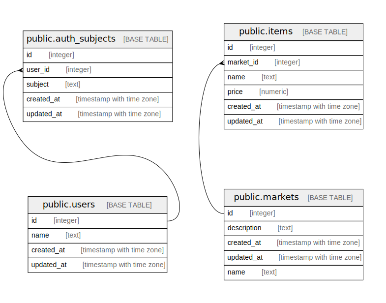

# share_cart

## Tables

| # | Name                                            | Columns | Comment | Type       |
| - | ----------------------------------------------- | ------- | ------- | ---------- |
| 1 | [public.users](public.users.md)                 | 4       |         | BASE TABLE |
| 2 | [public.auth_subjects](public.auth_subjects.md) | 5       |         | BASE TABLE |

## Relations

---

> Generated by [tbls](https://github.com/k1LoW/tbls)
