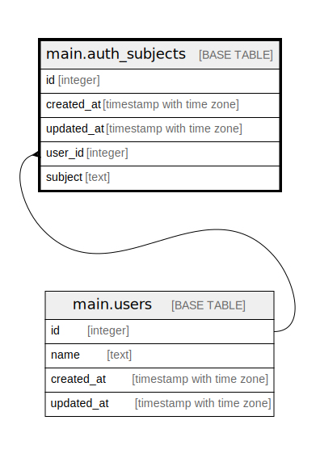

# main.auth_subjects

## Description

## Columns

| # | Name       | Type                     | Default | Nullable | Children | Parents                     | Comment |
| - | ---------- | ------------------------ | ------- | -------- | -------- | --------------------------- | ------- |
| 1 | id         | integer                  |         | false    |          |                             |         |
| 2 | created_at | timestamp with time zone |         | false    |          |                             |         |
| 3 | updated_at | timestamp with time zone |         | false    |          |                             |         |
| 4 | user_id    | integer                  |         | false    |          | [main.users](main.users.md) |         |
| 5 | subject    | text                     |         | false    |          |                             |         |

## Constraints

| # | Name               | Type        | Definition                                      |
| - | ------------------ | ----------- | ----------------------------------------------- |
| 1 | user_fk            | FOREIGN KEY | FOREIGN KEY (user_id) REFERENCES main.users(id) |
| 2 | auth_subjects_pkey | PRIMARY KEY | PRIMARY KEY (id)                                |
| 3 | subject            | UNIQUE      | UNIQUE (subject)                                |

## Indexes

| # | Name               | Definition                                                                    |
| - | ------------------ | ----------------------------------------------------------------------------- |
| 1 | auth_subjects_pkey | CREATE UNIQUE INDEX auth_subjects_pkey ON main.auth_subjects USING btree (id) |
| 2 | subject            | CREATE UNIQUE INDEX subject ON main.auth_subjects USING btree (subject)       |

## Relations

---

> Generated by [tbls](https://github.com/k1LoW/tbls)
