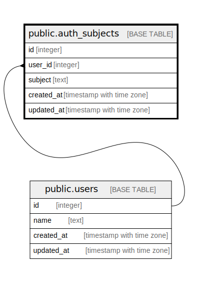

# public.auth_subjects

## Description

## Columns

| # | Name       | Type                     | Default | Nullable | Children | Parents                         | Comment |
| - | ---------- | ------------------------ | ------- | -------- | -------- | ------------------------------- | ------- |
| 1 | id         | integer                  |         | false    |          |                                 |         |
| 2 | user_id    | integer                  |         | false    |          | [public.users](public.users.md) |         |
| 3 | subject    | text                     |         | false    |          |                                 |         |
| 4 | created_at | timestamp with time zone |         | false    |          |                                 |         |
| 5 | updated_at | timestamp with time zone |         | false    |          |                                 |         |

## Constraints

| # | Name                     | Type        | Definition                                 |
| - | ------------------------ | ----------- | ------------------------------------------ |
| 1 | auth_subjects_user_id_fk | FOREIGN KEY | FOREIGN KEY (user_id) REFERENCES users(id) |
| 2 | auth_subjects_pkey       | PRIMARY KEY | PRIMARY KEY (id)                           |
| 3 | subject                  | UNIQUE      | UNIQUE (subject)                           |

## Indexes

| # | Name               | Definition                                                                      |
| - | ------------------ | ------------------------------------------------------------------------------- |
| 1 | auth_subjects_pkey | CREATE UNIQUE INDEX auth_subjects_pkey ON public.auth_subjects USING btree (id) |
| 2 | subject            | CREATE UNIQUE INDEX subject ON public.auth_subjects USING btree (subject)       |

## Relations

---

> Generated by [tbls](https://github.com/k1LoW/tbls)
