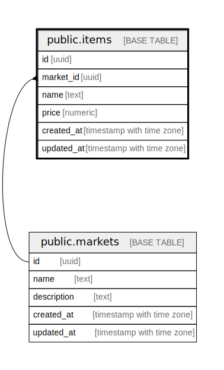

# public.items

## Description

## Columns

| # | Name       | Type                     | Default | Nullable | Children | Parents                             | Comment |
| - | ---------- | ------------------------ | ------- | -------- | -------- | ----------------------------------- | ------- |
| 1 | id         | uuid                     |         | false    |          |                                     |         |
| 2 | market_id  | uuid                     |         | false    |          | [public.markets](public.markets.md) |         |
| 3 | name       | text                     |         | false    |          |                                     |         |
| 4 | price      | numeric                  |         | false    |          |                                     |         |
| 5 | created_at | timestamp with time zone |         | false    |          |                                     |         |
| 6 | updated_at | timestamp with time zone |         | false    |          |                                     |         |

## Constraints

| # | Name               | Type        | Definition                                     |
| - | ------------------ | ----------- | ---------------------------------------------- |
| 1 | items_market_id_fk | FOREIGN KEY | FOREIGN KEY (market_id) REFERENCES markets(id) |
| 2 | items_pkey         | PRIMARY KEY | PRIMARY KEY (id)                               |
| 3 | items_name         | UNIQUE      | UNIQUE (name)                                  |

## Indexes

| # | Name       | Definition                                                        |
| - | ---------- | ----------------------------------------------------------------- |
| 1 | items_pkey | CREATE UNIQUE INDEX items_pkey ON public.items USING btree (id)   |
| 2 | items_name | CREATE UNIQUE INDEX items_name ON public.items USING btree (name) |

## Relations

---

> Generated by [tbls](https://github.com/k1LoW/tbls)
