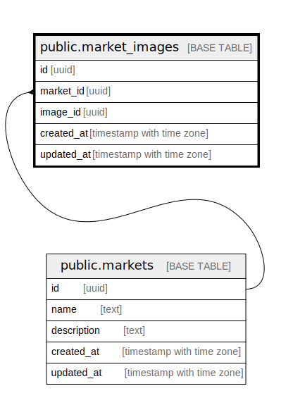

# public.market_images

## Description

## Columns

| # | Name       | Type                     | Default | Nullable | Children | Parents                             | Comment |
| - | ---------- | ------------------------ | ------- | -------- | -------- | ----------------------------------- | ------- |
| 1 | id         | uuid                     |         | false    |          |                                     |         |
| 2 | market_id  | uuid                     |         | false    |          | [public.markets](public.markets.md) |         |
| 3 | image_id   | uuid                     |         | false    |          |                                     |         |
| 4 | created_at | timestamp with time zone |         | false    |          |                                     |         |
| 5 | updated_at | timestamp with time zone |         | false    |          |                                     |         |

## Constraints

| # | Name                       | Type        | Definition                                     |
| - | -------------------------- | ----------- | ---------------------------------------------- |
| 1 | market_images_market_id_fk | FOREIGN KEY | FOREIGN KEY (market_id) REFERENCES markets(id) |
| 2 | market_images_pkey         | PRIMARY KEY | PRIMARY KEY (id)                               |

## Indexes

| # | Name               | Definition                                                                      |
| - | ------------------ | ------------------------------------------------------------------------------- |
| 1 | market_images_pkey | CREATE UNIQUE INDEX market_images_pkey ON public.market_images USING btree (id) |

## Relations

---

> Generated by [tbls](https://github.com/k1LoW/tbls)
