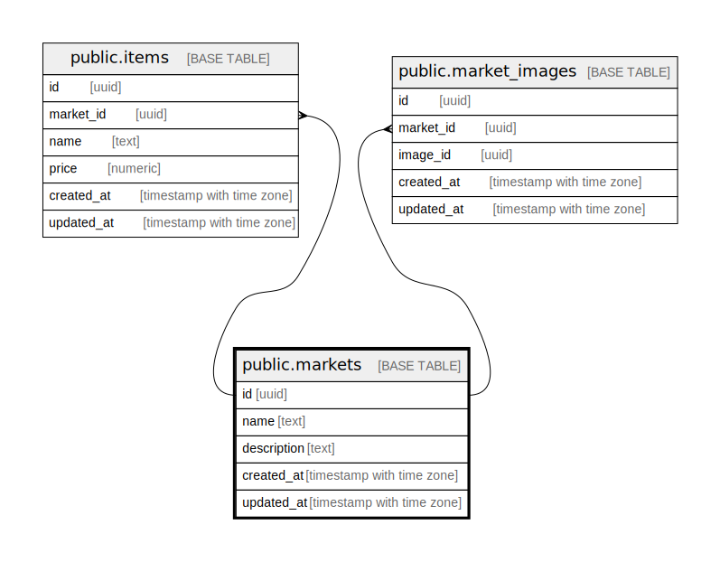

# public.markets

## Description

## Columns

| # | Name        | Type                     | Default | Nullable | Children                        | Parents | Comment |
| - | ----------- | ------------------------ | ------- | -------- | ------------------------------- | ------- | ------- |
| 1 | id          | uuid                     |         | false    | [public.items](public.items.md) |         |         |
| 2 | name        | text                     |         | false    |                                 |         |         |
| 3 | description | text                     |         | false    |                                 |         |         |
| 4 | created_at  | timestamp with time zone |         | false    |                                 |         |         |
| 5 | updated_at  | timestamp with time zone |         | false    |                                 |         |         |

## Constraints

| # | Name         | Type        | Definition       |
| - | ------------ | ----------- | ---------------- |
| 1 | markets_pkey | PRIMARY KEY | PRIMARY KEY (id) |
| 2 | markets_name | UNIQUE      | UNIQUE (name)    |

## Indexes

| # | Name         | Definition                                                            |
| - | ------------ | --------------------------------------------------------------------- |
| 1 | markets_pkey | CREATE UNIQUE INDEX markets_pkey ON public.markets USING btree (id)   |
| 2 | markets_name | CREATE UNIQUE INDEX markets_name ON public.markets USING btree (name) |

## Relations

---

> Generated by [tbls](https://github.com/k1LoW/tbls)
