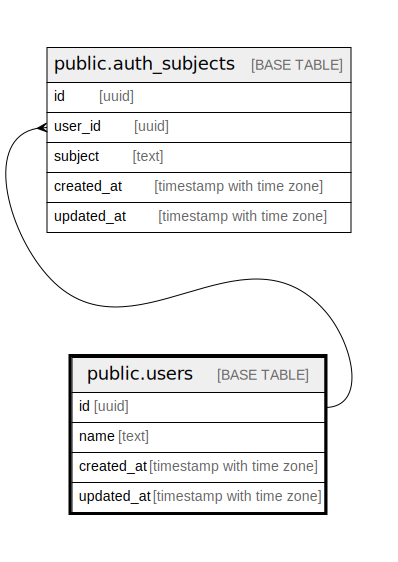

# public.users

## Description

## Columns

| # | Name       | Type                     | Default | Nullable | Children                                        | Parents | Comment |
| - | ---------- | ------------------------ | ------- | -------- | ----------------------------------------------- | ------- | ------- |
| 1 | id         | integer                  |         | false    | [public.auth_subjects](public.auth_subjects.md) |         |         |
| 2 | name       | text                     |         | false    |                                                 |         |         |
| 3 | created_at | timestamp with time zone |         | false    |                                                 |         |         |
| 4 | updated_at | timestamp with time zone |         | false    |                                                 |         |         |

## Constraints

| # | Name       | Type        | Definition       |
| - | ---------- | ----------- | ---------------- |
| 1 | users_pkey | PRIMARY KEY | PRIMARY KEY (id) |
| 2 | name       | UNIQUE      | UNIQUE (name)    |

## Indexes

| # | Name       | Definition                                                      |
| - | ---------- | --------------------------------------------------------------- |
| 1 | users_pkey | CREATE UNIQUE INDEX users_pkey ON public.users USING btree (id) |
| 2 | name       | CREATE UNIQUE INDEX name ON public.users USING btree (name)     |

## Relations

---

> Generated by [tbls](https://github.com/k1LoW/tbls)
